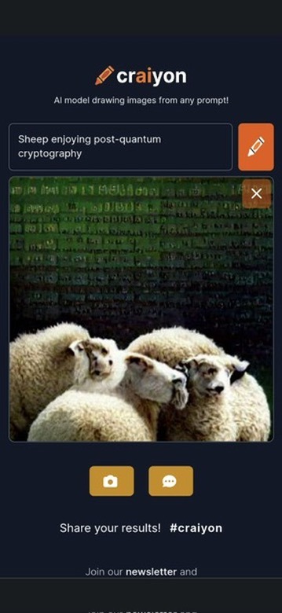

Dall-E mini, an open [reproduction](https://wandb.ai/dalle-mini/dalle-mini/reports/DALL-E-Mini-Explained-with-Demo--Vmlldzo4NjIxODA) of OpenAI Dall-E 2, is available as a [live demo "Craiyon"](https://www.craiyon.com) ([HuggingFace](https://huggingface.co/spaces/dalle-mini/dalle-mini)).

## Experiments with Craiyon
The text-to-image part works well:

My filter bubble is having fun with cryptography-related depictions:

Faces, either of humans or animals dont work well, though:

Or at least they are a bit of a hit-and-miss:

It's almost good enough for simple logos:

## Experiments with OpenAI Dall-E 2
[Update 2022-07-29]
OpenAI Dall-E 2 invite has arrived! Faces look much better:

Body parts can be off, though:

