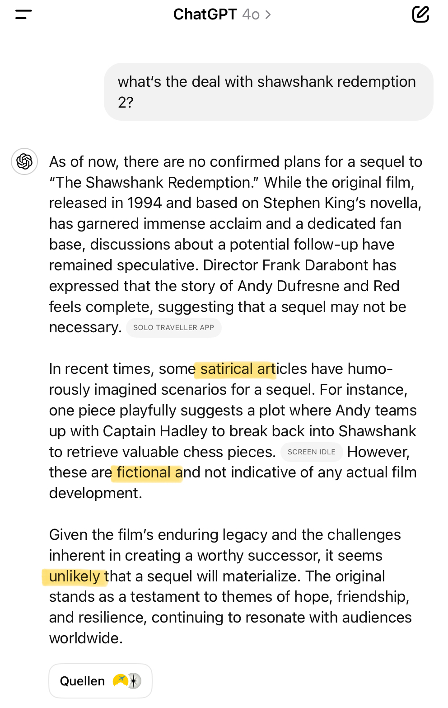

Simon Willison has surfaced renewed cases where Google Search shows so-called "featured snippets" (🇩🇪 "hervorgehobene Snippets") that answer the user search flat-out wrong. Simon writes on Bluesky:
> This is a particularly bad case-study in how badly AI summarization can go when its exposed to the wilds of the internet

It's not "AI Summarization" in the NLP sense of the word however ([Bluesky comment](https://bsky.app/profile/ndurner.bsky.social/post/3leg5jt6o6s2t)): rather, I would call it "RAG poisoning" or perhaps "search result poising". In essence, the problem to users is which search engines treat non-factual pages as sources of facts. In Simon's case, Google used fan-fiction pages to make up Featured Snippets about allegedly confirmed cinema movie releases like this:

Both ChatGPT with Search enabled, as well as Perplexity, stayed clear of presenting counter-factuals as actual facts, with Perplexity acknowledging "fan theories":

With another imaginary movie release, "Shawshank Redemption 2" as proposed in Simon's thread on X, Perplexity did perhaps not do as well, confirming that "There is a sequel to The Shawshank Redemption in the works":
\
Like Perplexity on Encanto 2, ChatGPT with Search enabled calls out the sequel as "imaginary scenarios", "fictional" and unlikely to happen:

ChatGPT with Search coming up clean in these two tests does not mean it's entirely safe to use, however. IT-news outlet The Verge has recently called "[ChatGPT’s search results ‘unpredictable’ and frequently inaccurate](https://www.theverge.com/2024/12/3/24312016/chatgpt-search-results-review-inaccurate-unpredictable?utm_source=chatgpt.com)" and called for "[Stop using generative AI as a search engine](https://www.theverge.com/2024/12/5/24313222/chatgpt-pardon-biden-bush-esquire?utm_source=chatgpt.com)". I haven't verified their claims, though.